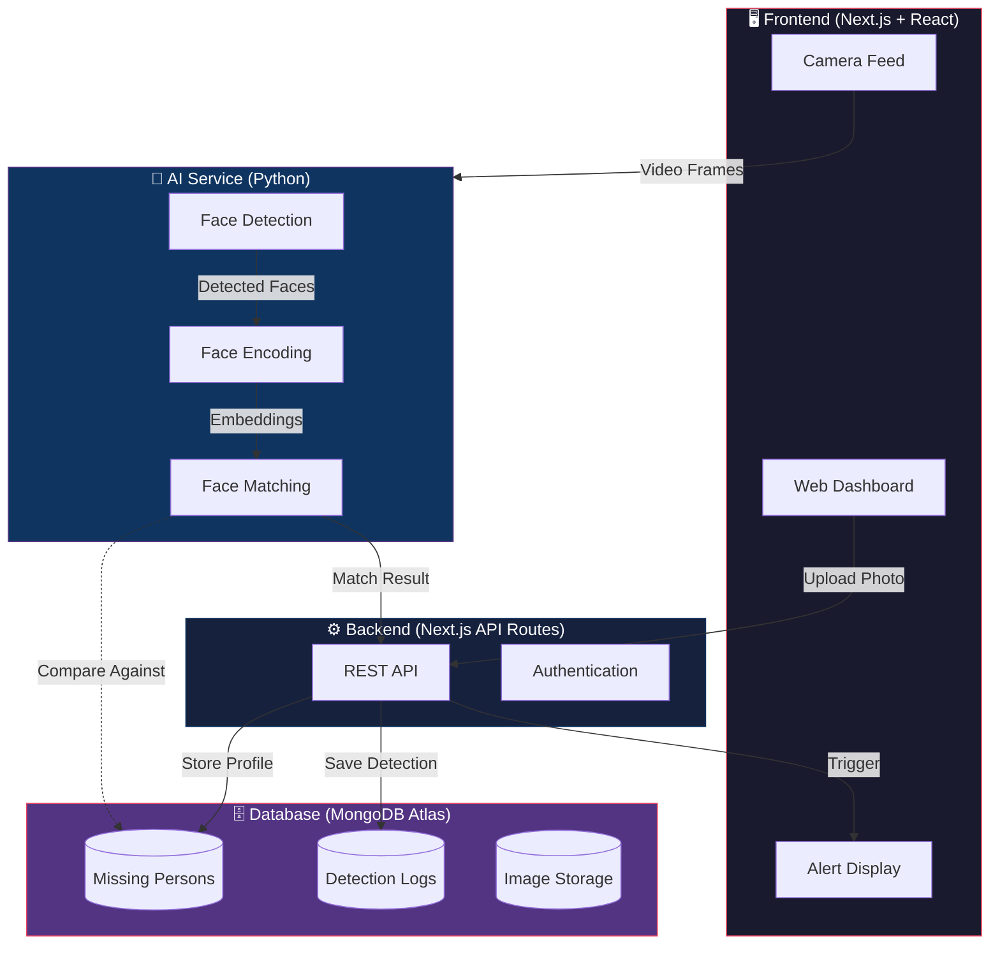

<div align="center">

# 🔍 FindSight AI

### AI-Powered Missing Person Detection & Tracking System

[](https://nextjs.org/)
[](https://reactjs.org/)
[](https://www.typescriptlang.org/)
[](https://tailwindcss.com/)
[](https://www.mongodb.com/)
[](https://www.python.org/)
[](https://opencv.org/)

[](LICENSE)
[](CONTRIBUTING.md)
[](https://github.com/Dhruvesh1611/FindSight-AI/stargazers)
[](https://github.com/Dhruvesh1611/FindSight-AI/network/members)
[](https://github.com/Dhruvesh1611/FindSight-AI/issues)

<br />

<p align="center">
  <strong>Leveraging AI & Computer Vision to locate missing persons faster through real-time surveillance analysis.</strong>
</p>

<p align="center">
  <a href="#-demo">Demo</a> •
  <a href="#-features">Features</a> •
  <a href="#%EF%B8%8F-tech-stack">Tech Stack</a> •
  <a href="#-getting-started">Getting Started</a> •
  <a href="#-api-endpoints">API Endpoints</a> •
  <a href="#-contributing">Contributing</a>
</p>

</div>

---

## 📌 Problem Statement

Every year, **thousands of people go missing** — children, elderly citizens, individuals with dementia, and other vulnerable populations. Public spaces like railway stations, airports, malls, and streets are equipped with surveillance cameras, but manually reviewing CCTV footage is **time-consuming, error-prone, and causes critical delays** in locating missing individuals.

**FindSight AI** bridges this gap by using **Artificial Intelligence and Computer Vision** to automate surveillance analysis, enabling faster identification and real-time alerts.

---

## 🎬 Demo

> _For the hackathon MVP, a mobile phone camera simulates a CCTV feed to demonstrate real-world functionality._

### Demo Workflow

```
1. Admin uploads a missing person's photo
2. Phone camera opens as a simulated CCTV feed
3. A person appears in front of the camera
4. AI detects and encodes the face in real time
5. Face is matched against registered profiles
6. System displays a match alert with confidence score
7. Detection is recorded in the dashboard
```

### 📸 Screenshots

<details>
<summary><strong>Click to expand screenshots</strong></summary>

<br />

| Screen | Preview |
|--------|---------|
| **Dashboard** | _screenshot coming soon_ |
| **Register Missing Person** | _screenshot coming soon_ |
| **Live Camera Feed** | _screenshot coming soon_ |
| **Match Alert** | _screenshot coming soon_ |
| **Detection Logs** | _screenshot coming soon_ |

> 💡 _Add your screenshots to `docs/screenshots/` and update the paths above._

</details>

---

## ✨ Features

### 🧑‍💼 Missing Person Registration
- Upload reference photo for facial matching
- Record name, age, gender, contact info & last seen location
- Store profiles securely in MongoDB Atlas

### 📹 Live CCTV Monitoring
- Real-time video streaming via browser
- Continuous face detection on every frame
- Camera status monitoring & health checks
- Phone camera as simulated CCTV source

### 🤖 AI Face Recognition
- **Face Detection** — Locate faces in video frames
- **Face Encoding** — Generate 128-dimensional facial embeddings
- **Face Comparison** — Compare against registered profiles
- **Similarity Scoring** — Calculate match confidence percentage

### 🚨 Alert System
- Instant match notifications when confidence exceeds threshold
- Match percentage display
- Detection timestamp
- Captured snapshot of detected individual

### 📊 Admin Dashboard
- Total registered cases overview
- Active search status
- Detection statistics & analytics
- Recent alerts feed
- Complete detection history

### 📝 Detection Logs
- Missing person ID tracking
- Detection timestamp records
- Confidence score storage
- Captured image archival
- Camera source identification

---

## 🏗️ Architecture



### System Workflow

```
┌──────────────┐     ┌──────────────┐     ┌──────────────┐
│  1. Upload   │────▶│  2. Store    │────▶│  3. Generate │
│  Photo       │     │  in MongoDB  │     │  Embeddings  │
└──────────────┘     └──────────────┘     └──────┬───────┘
                                                  │
┌──────────────┐     ┌──────────────┐     ┌──────▼───────┐
│  6. Compare  │◀────│  5. Encode   │◀────│  4. Start    │
│  Embeddings  │     │  Detected    │     │  Camera Feed │
└──────┬───────┘     │  Faces       │     └──────────────┘
       │             └──────────────┘
       │
┌──────▼───────┐     ┌──────────────┐
│  7. Match    │────▶│  8. Generate │────▶  9. Store in
│  Found?      │     │  Alert       │       Detection Logs
└──────────────┘     └──────────────┘
```

---

## 🛠️ Tech Stack

| Layer | Technology | Purpose |
|-------|-----------|---------|
| **Frontend** | Next.js, React, TypeScript | UI & client-side rendering |
| **Styling** | Tailwind CSS | Responsive design system |
| **Backend** | Next.js API Routes | REST API & server logic |
| **Database** | MongoDB Atlas + Mongoose | Data persistence & ODM |
| **AI / ML** | Python, OpenCV, face_recognition | Face detection & matching |
| **Deployment** | Vercel, MongoDB Atlas | Hosting & cloud database |

---

## 📁 Folder Structure

```
FindSight-AI/
├── public/                     # Static assets
│   ├── icons/                  # App icons & favicons
│   └── images/                 # Static images
│
├── src/
│   ├── app/                    # Next.js App Router
│   │   ├── api/                # API Routes
│   │   │   ├── persons/        # Missing person CRUD
│   │   │   ├── detections/     # Detection log endpoints
│   │   │   ├── camera/         # Camera feed management
│   │   │   └── match/          # Face matching endpoint
│   │   ├── dashboard/          # Admin dashboard page
│   │   ├── register/           # Registration page
│   │   ├── monitor/            # Live monitoring page
│   │   ├── logs/               # Detection logs page
│   │   ├── layout.tsx          # Root layout
│   │   └── page.tsx            # Landing page
│   │
│   ├── components/             # Reusable React components
│   │   ├── ui/                 # Base UI components
│   │   ├── dashboard/          # Dashboard widgets
│   │   ├── camera/             # Camera feed components
│   │   └── alerts/             # Alert components
│   │
│   ├── lib/                    # Utility libraries
│   │   ├── db.ts               # MongoDB connection
│   │   ├── mongoose.ts         # Mongoose config
│   │   └── utils.ts            # Helper functions
│   │
│   ├── models/                 # Mongoose schemas
│   │   ├── Person.ts           # Missing person model
│   │   └── Detection.ts        # Detection log model
│   │
│   ├── services/               # Business logic
│   │   ├── faceRecognition.ts  # AI service integration
│   │   └── alertService.ts     # Alert management
│   │
│   └── types/                  # TypeScript type definitions
│       └── index.ts            # Shared types
│
├── ai-service/                 # Python AI microservice
│   ├── main.py                 # FastAPI / Flask server
│   ├── face_detector.py        # Face detection module
│   ├── face_encoder.py         # Face encoding module
│   ├── face_matcher.py         # Face comparison module
│   ├── requirements.txt        # Python dependencies
│   └── models/                 # Pre-trained model weights
│
├── docs/                       # Documentation
│   └── screenshots/            # App screenshots
│
├── .env.example                # Environment variable template
├── .gitignore                  # Git ignore rules
├── next.config.js              # Next.js configuration
├── tailwind.config.ts          # Tailwind CSS configuration
├── tsconfig.json               # TypeScript configuration
├── package.json                # Node.js dependencies
└── README.md                   # Project documentation
```

---

## 🚀 Getting Started

### Prerequisites

Ensure you have the following installed:

| Tool | Version | Download |
|------|---------|----------|
| **Node.js** | >= 18.x | [nodejs.org](https://nodejs.org/) |
| **Python** | >= 3.9 | [python.org](https://www.python.org/) |
| **MongoDB Atlas** | Cloud | [mongodb.com/atlas](https://www.mongodb.com/atlas) |
| **Git** | Latest | [git-scm.com](https://git-scm.com/) |

### Installation

**1. Clone the repository**

```bash
git clone https://github.com/Dhruvesh1611/FindSight-AI.git
cd FindSight-AI
```

**2. Install frontend dependencies**

```bash
npm install
```

**3. Set up the Python AI service**

```bash
cd ai-service
python -m venv venv

# macOS / Linux
source venv/bin/activate

# Windows
venv\Scripts\activate

pip install -r requirements.txt
cd ..
```

**4. Configure environment variables**

```bash
cp .env.example .env
```

Edit `.env` with your credentials:

```env
# MongoDB
MONGODB_URI=mongodb+srv://<username>:<password>@cluster.mongodb.net/findsight-ai

# AI Service
AI_SERVICE_URL=http://localhost:8000
MATCH_CONFIDENCE_THRESHOLD=0.6

# Next.js
NEXT_PUBLIC_APP_URL=http://localhost:3000

# Optional
NEXTAUTH_SECRET=your-secret-key
```

**5. Start the development servers**

```bash
# Terminal 1 — Start the Next.js frontend
npm run dev

# Terminal 2 — Start the Python AI service
cd ai-service
source venv/bin/activate
python main.py
```

**6. Open your browser**

Navigate to **[http://localhost:3000](http://localhost:3000)** to access the dashboard.

---

## 📡 API Endpoints

### Missing Persons

| Method | Endpoint | Description |
|--------|----------|-------------|
| `GET` | `/api/persons` | List all registered missing persons |
| `GET` | `/api/persons/:id` | Get a specific missing person profile |
| `POST` | `/api/persons` | Register a new missing person |
| `PUT` | `/api/persons/:id` | Update missing person details |
| `DELETE` | `/api/persons/:id` | Remove a missing person record |

### Detections

| Method | Endpoint | Description |
|--------|----------|-------------|
| `GET` | `/api/detections` | List all detection logs |
| `GET` | `/api/detections/:id` | Get a specific detection record |
| `POST` | `/api/detections` | Create a new detection entry |
| `GET` | `/api/detections/recent` | Get recent detections |

### Face Matching

| Method | Endpoint | Description |
|--------|----------|-------------|
| `POST` | `/api/match` | Compare a captured face against registered profiles |
| `POST` | `/api/match/encode` | Generate face encoding from an uploaded image |

### Camera

| Method | Endpoint | Description |
|--------|----------|-------------|
| `GET` | `/api/camera/status` | Check camera feed status |
| `POST` | `/api/camera/start` | Start the camera feed |
| `POST` | `/api/camera/stop` | Stop the camera feed |

---

## 🗃️ Database Schema

### Missing Person

```typescript
{
  _id: ObjectId,
  name: string,
  age: number,
  gender: "male" | "female" | "other",
  contactInfo: {
    phone: string,
    email?: string,
    guardianName?: string
  },
  lastSeenLocation: string,
  lastSeenDate: Date,
  photo: string,              // URL or base64
  faceEncoding: number[],     // 128-dimensional vector
  status: "searching" | "found" | "closed",
  createdAt: Date,
  updatedAt: Date
}
```

### Detection Log

```typescript
{
  _id: ObjectId,
  personId: ObjectId,         // Reference to missing person
  timestamp: Date,
  confidenceScore: number,    // 0.0 to 1.0
  capturedImage: string,      // Snapshot URL or base64
  cameraSource: string,       // Camera identifier
  location?: string,
  verified: boolean,          // Human verification status
  createdAt: Date
}
```

---

## 🎯 Target Users

<table>
  <tr>
    <td align="center">👮<br /><strong>Police Departments</strong></td>
    <td align="center">🔍<br /><strong>Investigation Units</strong></td>
    <td align="center">🚂<br /><strong>Railway Security</strong></td>
  </tr>
  <tr>
    <td align="center">✈️<br /><strong>Airport Security</strong></td>
    <td align="center">🤝<br /><strong>NGOs</strong></td>
    <td align="center">🏙️<br /><strong>Smart City Centers</strong></td>
  </tr>
</table>

---

## 🗺️ Roadmap

- [x] Core face detection & recognition engine
- [x] Missing person registration system
- [x] Live camera feed integration
- [x] Real-time alert system
- [x] Detection logging & history
- [x] Admin dashboard
- [ ] 🔐 Authentication & role-based access
- [ ] 📷 Multi-camera support
- [ ] 📍 GPS-based location tracking
- [ ] 🏙️ Smart city surveillance integration
- [ ] 👶 Age progression models
- [ ] 🌐 Cross-city surveillance network
- [ ] 📱 Mobile app for authorities
- [ ] 🔔 Push notification system (SMS / Email / WhatsApp)
- [ ] ☁️ Cloud-based AI processing & scaling
- [ ] 📊 Advanced analytics & heatmaps

---

## 🤝 Contributing

Contributions are what make the open-source community amazing. Any contributions you make are **greatly appreciated**.

### How to Contribute

1. **Fork** the repository

2. **Create** your feature branch
   ```bash
   git checkout -b feature/amazing-feature
   ```

3. **Commit** your changes
   ```bash
   git commit -m "feat: add amazing feature"
   ```

4. **Push** to the branch
   ```bash
   git push origin feature/amazing-feature
   ```

5. **Open** a Pull Request

### Commit Convention

This project follows [Conventional Commits](https://www.conventionalcommits.org/):

| Prefix | Purpose |
|--------|---------|
| `feat:` | New feature |
| `fix:` | Bug fix |
| `docs:` | Documentation changes |
| `style:` | Code style / formatting |
| `refactor:` | Code refactoring |
| `test:` | Adding or updating tests |
| `chore:` | Maintenance tasks |

### Development Guidelines

- Write clean, well-documented TypeScript code
- Follow the existing project structure and patterns
- Add appropriate error handling
- Test your changes before submitting a PR
- Update documentation if your changes affect the public API

---

## 🌟 Social Impact

FindSight AI aims to **reduce the time required to locate missing individuals** by automating surveillance analysis.

| Impact Area | Benefit |
|-------------|---------|
| ⚡ **Speed** | Faster identification compared to manual review |
| 🧠 **Efficiency** | Reduced manual monitoring workload |
| 📹 **Infrastructure** | Better utilization of existing surveillance systems |
| 🛡️ **Safety** | Improved public safety measures |
| 🚨 **Response** | Enhanced emergency response capabilities |

---

## ⚠️ Disclaimer

> This project is a **hackathon prototype** created for educational and social impact purposes. The current implementation uses a **simulated CCTV feed** and is intended to demonstrate the feasibility of AI-assisted missing person detection. **Human verification is required for all detections**, and the system is **not intended to replace official investigation procedures**.

---

## 📄 License

This project is licensed under the **MIT License** — see the [LICENSE](LICENSE) file for details.

---

## 🙏 Acknowledgments

- [face_recognition](https://github.com/ageitgey/face_recognition) — Face recognition library built with dlib
- [OpenCV](https://opencv.org/) — Computer vision library
- [Next.js](https://nextjs.org/) — React framework for production
- [MongoDB Atlas](https://www.mongodb.com/atlas) — Cloud database service
- [Tailwind CSS](https://tailwindcss.com/) — Utility-first CSS framework
- [Vercel](https://vercel.com/) — Deployment platform

---

<div align="center">

**Built with ❤️ for social good**

⭐ Star this repo if you find it useful! ⭐

[Report Bug](https://github.com/Dhruvesh1611/FindSight-AI/issues) · [Request Feature](https://github.com/Dhruvesh1611/FindSight-AI/issues)

</div>
